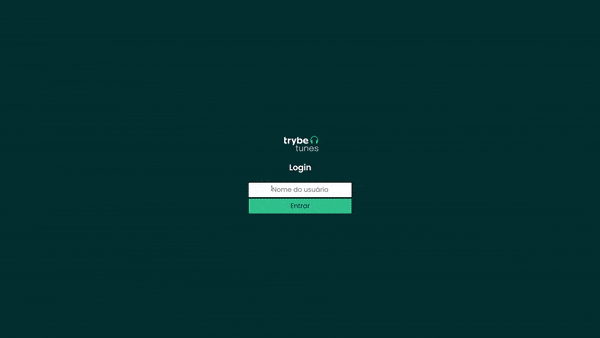

## Trybetunes Project

[Deploy link](https://trybetunes-erik.netlify.app/)

## About
&nbsp;&nbsp; In this project, I developed a music application. The user can search for artists listed on the '[iTunes API](https://developer.apple.com/library/archive/documentation/AudioVideo/Conceptual/iTuneSearchAPI/index.html)'. My goal was to develop a page based on the requirements given by '[Trybe](https://www.betrybe.com/)'.
	
## Requirements Overview:
- [x] Login Page;
- [x] Search the API for an artist/band;
- [x] List the artist albums;
- [x] List the album's songs;
- [x] Favorite a song;
- [x] Profile Page;

## Skills Developed:
- [x] Request and consume data from an API;
- [x] Use React Components' Lifecycle;
- [x] Work with `setState` asynchronicity;
- [x] Apply `BrowserRouter`, `Route`, `Switch` and `Link` correctly;

## Files:
&nbsp;&nbsp; Files developed by me:

- all files inside the src/components folder;
- all files inside the src/pages folder;
- App.js;

All the other files where developed by Trybe, some of them with minor adjustments made by me.

## Technologies:
All technologies applied by me on this project:
- React (with React Router)
- Javascript;
- CSS;
- HTML;

## How to run the project:
- Access [https://trybetunes-erik.netlify.app/](https://trybetunes-erik.netlify.app/)
- Or git clone the repository;
- Navigate to the folder and install the dependencies with `npm install`;
- Done! Now you can start the application with `npm start`!
